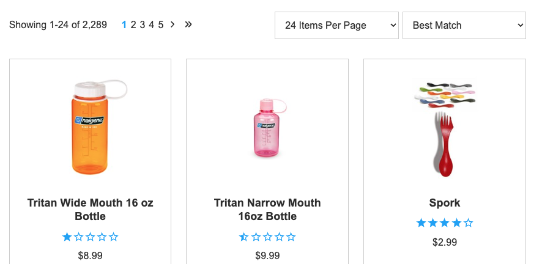
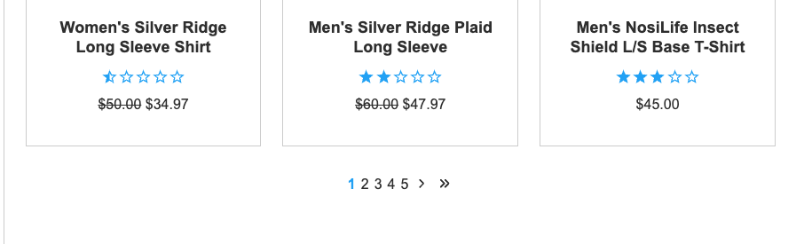
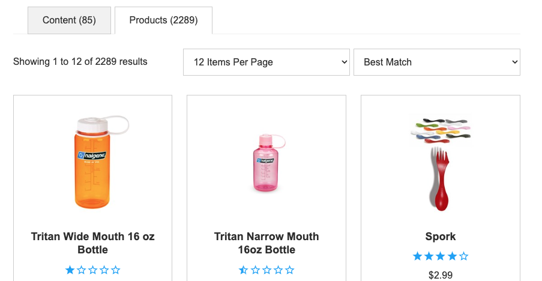

# Custom Pagination Summary Component

In Rapid UI, the pagination summary (ex. Showing 1 to 24 of 100 results) is part of the pagination component which is at the top of the search results component. This example shows building a customElement to hook into the Rapid UI pagination event, to build a new "pagination-summary" element which can be used elsewhere.

To test the index.html file, you will need to substitute `{{your_client_guid}}` and `{{your_search_endpoint}}` with your own. Due to configuration differences between engines, your search results may not look exactly the same as the example screenshots.

## Notes:

- We are overriding the default [Pagination component](https://handlebars-ui.hawksearch.com/latest/classes/Components.PaginationComponent.html) and [Search Results component](https://handlebars-ui.hawksearch.com/latest/classes/Components.SearchResultsComponent.html) templates to accomplish this. Please see lines 52 to 145 of [index.html](index.html#L52-L145)
- This is the original look and field of the Pagination component.
  
  
- We first create our customElement, hooking into bind-pagination to inherit the available event details.
  ```
  customElements.define('pagination-summary', class extends HTMLElement {
      constructor () {
          super();
          this.attachShadow({mode: 'open'});
          addEventListener('hawksearch:bind-pagination', (event) => {
              this.shadowRoot.innerHTML = '';
              const summaryDiv = document.createElement('div');
              summaryDiv.classList.add('pagination__summary');
              if (event.detail?.pageSize) {
                  const firstRecord = (event.detail.page - 1) * event.detail.pageSize + 1;
                  let lastRecord = firstRecord + event.detail.pageSize - 1;
                  if (lastRecord > event.detail.totalResults) {
                      lastRecord = event.detail.totalResults;
                  }
                  summaryDiv.innerText = 'Showing ' + firstRecord + ' to ' + lastRecord + ' of ' + event.detail.totalResults + ' results';
              } else {
                  summaryDiv.innerText = '';
              }
              this.shadowRoot.append(summaryDiv);
          });
      }
  });
  ```
- As part of the Pagination component, we removed this code block.
  ```
  {{#if strings.summary}}
      <div class="pagination__summary">{{strings.summary}}</div>
  {{/if}}
  ```
- As part of the Search Results component, we moved the Pagination component underneath the Search Results component.
  ```
  <hawksearch-search-results-list></hawksearch-search-results-list>
  <div class="row">
      <div class="column column--12 flex-vertical-sm-center">
          <hawksearch-pagination></hawksearch-pagination>
      </div>
  </div>
  ```
  
- Finally, we replaced the Pagination component with our custom Pagination Summary component.
  ```
  <div class="row">
      <div class="column column--12">
          <div class="row row--tight">
              <div class="column column--12 column-sm--4 flex-vertical-sm-center">
                  <pagination-summary></pagination-summary>
              </div>
              ...
  ```
  
- Some additional CSS was required to center the pagination component.